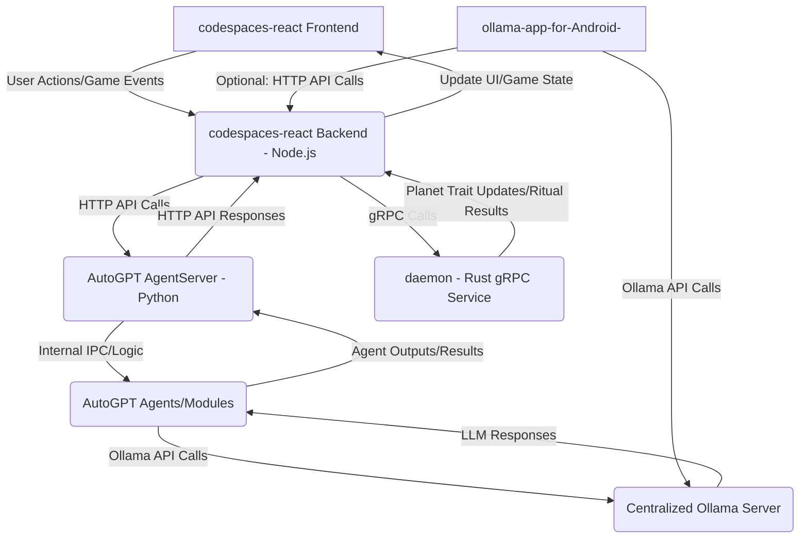

# WithMyStar Project Integration Strategy

## Overview

This document outlines the strategy for integrating key components of the `WithMyStar` project: `AutoGPT`, `codespaces-react`, `daemon`, and `ollama-app-for-Android-`. The goal is to create a cohesive system where these components work together to deliver a gamified LLM training experience with AI agent capabilities.

## 1. Centralized Ollama Server

To ensure consistent LLM model access for both `AutoGPT` and `ollama-app-for-Android-`, a single, centralized Ollama server instance will be deployed.

### Setup

1.  **Install Ollama:** Follow the official Ollama installation guide for your operating system (e.g., Linux, macOS, Windows with WSL2).
    *   [https://ollama.com/download](https://ollama.com/download)
2.  **Configure Ollama Host:** Before starting the Ollama server, set the `OLLAMA_HOST` environment variable to `0.0.0.0:11434` to allow network access.
    *   **Linux/macOS:** `export OLLAMA_HOST=0.0.0.0:11434`
    *   **Windows (Command Prompt):** `set OLLAMA_HOST=0.0.0.0:11434`
3.  **Start Ollama Server:** Run `ollama serve` in a terminal. Keep this terminal open.
4.  **Pull Models:** In a new terminal, pull the desired LLM models (e.g., `ollama pull llama3.2`).

## 2. `codespaces-react` as the Primary Orchestrator

The `codespaces-react` Node.js backend will serve as the central hub for orchestrating interactions between the frontend, `AutoGPT`, and `daemon`.

### 2.1. `codespaces-react` <-> `AutoGPT` API Integration

The `codespaces-react` Node.js backend will communicate with `AutoGPT`'s `AgentServer` via HTTP requests.

*   **AutoGPT AgentServer API Endpoint:** `http://localhost:8006` (default port)

#### Functionality

*   **Triggering Agents:** `codespaces-react` will send requests to `AutoGPT` to initiate AI agent workflows based on user actions or game events.
*   **Passing Data:** Relevant data (e.g., LLM training progress, user input, game state) will be passed to `AutoGPT` agents as part of the API requests.
*   **Receiving Results:** `codespaces-react` will poll or receive callbacks from `AutoGPT` to get agent outputs, which will then be used to update the gamified UI.

#### Example Node.js Code (Conceptual)

```javascript
// In codespaces-react/server/index.js or a dedicated service file

const axios = require('axios'); // Assuming axios is installed

async function triggerAutoGPTAgent(agentName, inputData) {
    try {
        const response = await axios.post('http://localhost:8006/api/v1/agent/trigger', {
            agent: agentName,
            data: inputData
        });
        console.log('AutoGPT Agent triggered:', response.data);
        return response.data;
    } catch (error) {
        console.error('Error triggering AutoGPT agent:', error.message);
        throw error;
    }
}

// Example usage:
// triggerAutoGPTAgent('planet_evolution_agent', { training_data: '...' });
```

### 2.2. `codespaces-react` <-> `daemon` gRPC Integration

The `codespaces-react` Node.js backend will interact with the `daemon`'s `RitualService` using gRPC.

*   **`daemon` gRPC Endpoint:** To be determined (e.g., `localhost:50051`)

#### Generating Node.js gRPC Client

1.  **Install `grpc-tools` and `@grpc/grpc-js`:**
    `npm install grpc-tools @grpc/grpc-js`
2.  **Generate Client Code:** Use `grpc-tools` to generate Node.js client stubs from `daemon/src/ritual.proto`.
    ```bash
    grpc_tools_node_protoc \
      --js_out=import_style=commonjs,binary:./generated \
      --grpc_out=grpc_js:./generated \
      --plugin=protoc-gen-grpc=./node_modules/.bin/grpc_tools_node_protoc_plugin \
      -I /home/brandon/WithMyStar/daemon/src \
      /home/brandon/WithMyStar/daemon/src/ritual.proto
    ```
    (Note: Adjust `./generated` to your desired output directory within `codespaces-react/server/`)

#### Functionality

*   **`SyncTraits`:** Update the visual planet traits based on LLM training progress or AutoGPT agent actions.
*   **`PerformRitual`:** Trigger specific gamified events or actions within the `WithMyStar` system.
*   **`GenerateKeyPair`:** Utilize for any security or authentication mechanisms requiring key generation.

#### Example Node.js gRPC Client Usage (Conceptual)

```javascript
// In codespaces-react/server/services/daemonService.js

const grpc = require('@grpc/grpc-js');
const protoLoader = require('@grpc/proto-loader');
const PROTO_PATH = '/home/brandon/WithMyStar/daemon/src/ritual.proto'; // Adjust path as needed

const packageDefinition = protoLoader.loadSync(
    PROTO_PATH,
    {
        keepCase: true,
        longs: String,
        enums: String,
        defaults: true,
        oneofs: true
    }
);
const ritual_proto = grpc.loadPackageDefinition(packageDefinition).ritual;

const client = new ritual_proto.RitualService('localhost:50051', grpc.credentials.createInsecure()); // Adjust daemon endpoint

function syncPlanetTraits(traits) {
    return new Promise((resolve, reject) => {
        client.SyncTraits({ traits: traits }, (error, response) => {
            if (error) {
                return reject(error);
            }
            resolve(response);
        });
    });
}

// Example usage:
// syncPlanetTraits([{ name: 'atmosphere', value: 'thick' }, { name: 'color', value: 'blue' }])
//   .then(response => console.log('Traits synced:', response))
//   .catch(error => console.error('Error syncing traits:', error));
```

## 3. `ollama-app-for-Android-` Configuration

The `ollama-app-for-Android-` will connect to the centralized Ollama server.

### Configuration Steps

1.  **Install `ollama-app-for-Android-`:** Download and install the APK on your Android device.
2.  **Initial Setup:** During the initial setup or in the app's settings, configure the "Ollama Host" to point to the IP address and port of your centralized Ollama server (e.g., `http://<OLLAMA_SERVER_IP>:11434`).

### Optional: AutoGPT Triggering via `codespaces-react`

For more advanced scenarios, the Android app could be extended to make HTTP requests to the `codespaces-react` Node.js backend. This would allow the Android app to initiate complex AutoGPT agent workflows. This is a future consideration.

## 4. Data Flow Diagram (Conceptual)



## 5. Future Considerations

*   **Error Handling and Robustness:** Implement comprehensive error handling, retry mechanisms, and logging across all integrations.
*   **Authentication and Authorization:** Secure communication between components, especially for API endpoints.
*   **Scalability:** Consider load balancing and horizontal scaling for components as the system grows.
*   **Unified Logging and Monitoring:** Implement a centralized logging and monitoring solution to track the health and performance of the integrated system.
*   **Shared Data Models:** Explore using shared data models or a common data layer to simplify data exchange between components.
