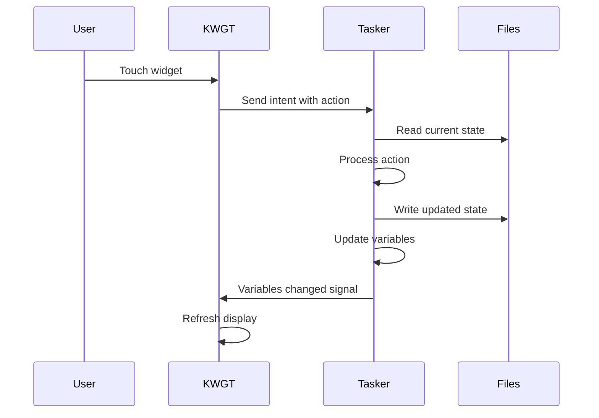

# Technical Specifications

This document provides detailed technical specifications for the WithMyStar project architecture, state management, and integration patterns.

## System Architecture

### Overview
WithMyStar uses a hybrid no-code/low-code architecture combining Android apps for implementation with standard JSON for state management and optional web technologies for advanced features.

```mermaid
graph TD
    KWGT[KWGT Widget (UI Layer)] <--> Tasker[Tasker (Logic)]
    Tasker <--> StateJSON[State JSON (Data)]
    UserInput[User Input (Touch/Voice)] --> KWGT
    Commands[Commands (JSON)] --> Tasker
    StateJSON --> Backups[Backups (Cloud/Local)]
```

### Component Details

#### KWGT Widget (Presentation Layer)
- **Purpose**: Visual representation of planet state
- **Technology**: KWGT (Kustom Widget Maker)
- **Data Source**: Tasker global variables
- **Update Mechanism**: Variable change triggers
- **Rendering**: Real-time based on state variables

#### Tasker (Business Logic Layer)
- **Purpose**: State management, automation, and safety features
- **Technology**: Tasker automation app
- **Data Storage**: JSON files on device storage
- **Integration**: KWGT variables, Android intents, file I/O
- **Execution**: Event-driven profiles and tasks

#### State Management (Data Layer)
- **Format**: JSON following defined schema
- **Location**: `/storage/emulated/0/WithMyStar/state/`
- **Backup**: Local and optional cloud storage
- **Validation**: Schema-based validation in Tasker
- **History**: Audit log with timestamps

## State Schema Specification

### Core Structure
```typescript
type MoodType = "thriving" | "calm" | "recovering" | "growing" | "dormant";

interface CoreStructure {
  version: 1;           // Schema version for migrations
  safeMode: boolean;      // Global safety toggle
  planet: { ... };      // Planet visual state
  score: { ... };       // Progress and achievements
  mood: MoodType;           // Emotional state
  flags: { ... };       // User preferences
  logs: [ ... ];        // Audit trail
  lastBackup: 0;        // Backup timestamp
  created: 0;            // Creation timestamp
}
```

### Planet State Properties
```typescript
interface PlanetState {
  level: number;          // 0-100, overall advancement
  evolution: number;      // 0.0-1.0, primary progress
  biome: BiomeType;       // Visual theme
  cityTiers: number;      // 0-5, civilization level
  satellites: number;     // 0-4, orbital objects
  weather: WeatherType;   // Atmospheric effects
  season: SeasonType;     // Time-of-day cycle
}

type BiomeType = "neon-ocean" | "cyber-forest" | "crystal-desert" | "aurora-tundra" | "void-nebula";
type WeatherType = "clear" | "aurora" | "storm" | "nebula" | "eclipse";
type SeasonType = "dawn" | "day" | "dusk" | "night";
```

### Score and Progress
```typescript
interface ScoreState {
  daily: number;          // 0-100, today's progress
  streakDays: number;     // Consecutive active days
  questsCompleted: number;// Total completed quests
  benchmark?: number;     // 0.0-1.0, optional AI benchmark
}
```

## Variable Mapping

### Tasker Global Variables
| Variable Name | Type | Range | Purpose |
|---------------|------|-------|---------|
| `%WITHMYSTAR_EVOLUTION` | Integer | 0-100 | Planet evolution percentage |
| `%WITHMYSTAR_LEVEL` | Integer | 0-100 | Planet level |
| `%WITHMYSTAR_STREAK` | Integer | 0+ | Daily streak counter |
| `%WITHMYSTAR_CITY` | Integer | 0-5 | City tier level |
| `%WITHMYSTAR_SATELLITES` | Integer | 0-4 | Satellite count |
| `%WITHMYSTAR_MOOD` | String | enum | Current mood state |
| `%WITHMYSTAR_BIOME` | String | enum | Current biome |
| `%WITHMYSTAR_WEATHER` | String | enum | Weather effect |
| `%WITHMYSTAR_SEASON` | String | enum | Time of day |
| `%WITHMYSTAR_SAFEMODE` | Boolean | 0/1 | Safe mode status |
| `%WITHMYSTAR_LABEL` | String | text | Display label |

### KWGT Formula Integration
```
Evolution Ring Progress: $withmystar_evolution$
Streak Ring Progress: $withmystar_streak*10$ // Multiplied by 10 to scale streak days to a 0-100 range for the progress ring
Planet Color: $if(withmystar_mood=thriving, #00FFFF, #0080FF)$
City Visibility: $withmystar_city>=1$
Label Text: $withmystar_label$
Safe Mode Opacity: $if(withmystar_safemode=1, 50, 100)$
```

## Command Protocol

### Command Structure
```json
{
  "cmd": "command_name",
  "path": "object.property",
  "value": "new_value",
  "source": "user|system|auto|recovery"
}
```

### Supported Commands
| Command | Parameters | Purpose |
|---------|------------|---------|
| `get` | `path` | Retrieve state value |
| `set` | `path`, `value` | Set state value |
| `inc` | `path`, `delta` | Increment numeric value |
| `toggle` | `path` | Toggle boolean value |
| `log` | `event`, `detail` | Add audit log entry |
| `backup` | none | Create state backup |
| `restore` | `backupName` | Restore from backup |
| `safe_mode` | `on|off` | Toggle safe mode |
| `simulate` | `scenario` | Run test scenario |
| `reset` | `scope` | Reset portions of state |

### Command Processing Flow
1. **Watch**: Tasker monitors `/WithMyStar/commands.json` (typically using a 'File Modified' event or a periodic check)
2. **Parse**: JSON parsed and validated
3. **Execute**: Command applied to state
4. **Log**: Action recorded in audit log
5. **Save**: Updated state written to disk
6. **Update**: KWGT variables refreshed
7. **Clear**: Command file emptied

## File System Structure

### Directory Layout
```
/storage/emulated/0/WithMyStar/
├── state/
│   ├── current.json         // Active state
│   ├── schema.json          // Validation schema
│   └── samples/             // Example states
│       ├── new-planet.json
│       └── advanced-planet.json
├── backups/
│   ├── state-YYYY-MM-DD.json
│   └── auto-backup-*.json
├── tasker/
│   ├── profiles.xml         // Tasker profiles export
│   ├── tasks.xml           // Tasker tasks export
│   └── variables.txt       // Variable documentation
├── kwgt/
│   ├── planet_widget.kwgt  // Widget export
│   └── assets/             // Visual assets
│       ├── icons/
│       └── textures/
├── logs/
│   └── debug.txt           // Debug information
└── commands.json           // Active command (temp, cleared after processing)
```

### File Permissions
- **State files**: 644 (owner can read/write, group/others can read)
- **Backup files**: 644 (owner can read/write, group/others can read)
- **Command file**: 666 (all users can read/write - temporary)
- **Log files**: 644 (owner can read/write, group/others can read)

## Integration Patterns

### KWGT ↔ Tasker Communication


### State Update Flow
1. **Trigger**: User action, timer, or external event
2. **Load**: Current state read from JSON file
3. **Validate**: State checked against schema
4. **Modify**: Changes applied with logging
5. **Save**: Updated state written atomically
6. **Propagate**: Variables updated for KWGT
7. **Backup**: Automatic backup if significant change

### Error Handling
- **File corruption**: Restore from most recent backup
- **Schema mismatch**: Migrate to current version
- **Permission errors**: Guide user through fixes
- **Widget crash**: Rebuild from state data
- **Tasker failure**: Emergency safe mode activation

## Performance Specifications

### Update Frequency
- **Real-time**: Variable changes (immediate)
- **High frequency**: User interactions (< 100ms)
- **Medium frequency**: Progress updates (1-60 minutes)
- **Low frequency**: Daily maintenance (24 hours)

### Resource Usage
- **Storage**: < 10MB total (including backups)
- **RAM**: < 50MB (KWGT + Tasker combined)
- **CPU**: Minimal (event-driven updates only)
- **Battery**: < 1% daily (optimized profiles)

### Scalability Limits
- **Maximum logs**: 1000 entries (auto-pruned)
- **Maximum backups**: 30 days retention
- **State file size**: < 1MB
- **Widget complexity**: Limited by KWGT constraints

## Security Model

### Threat Model
- **Local access**: Other apps reading state files
- **Data loss**: Device failure or corruption
- **Privacy**: Accidental cloud exposure
- **Tampering**: Malicious state modification

### Protection Mechanisms
- **File permissions**: Restrictive access controls
- **Input validation**: All data validated against schema
- **Backup integrity**: Checksums and validation
- **Safe restoration**: Backup validation before restore
- **Audit logging**: Complete change history

### Privacy Guarantees
- **Local by default**: No network communication required
- **Optional cloud**: User-controlled backup only
- **No analytics**: No usage tracking or telemetry
- **Data portability**: Export functionality always available

## Extension Points

### Future Enhancements
- **Web interface**: Browser-based planet viewer
- **API integration**: Connect to external services
- **Plugin system**: Custom quest types
- **Multi-device sync**: Cross-device state sharing
- **Advanced AI**: Local model integration

### Compatibility Considerations
- **Android versions**: 7.0+ (API level 24+)
- **KWGT versions**: 3.50+ (for full feature set)
- **Tasker versions**: 5.0+ (for JSON support)
- **Storage requirements**: 50MB+ free space

This specification is versioned and will be updated as the project evolves. All changes will maintain backward compatibility with existing installations.